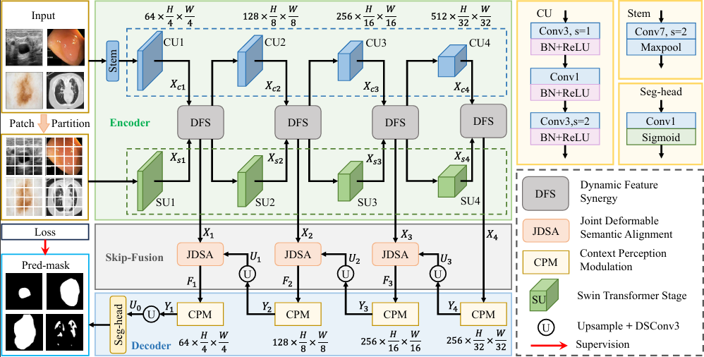
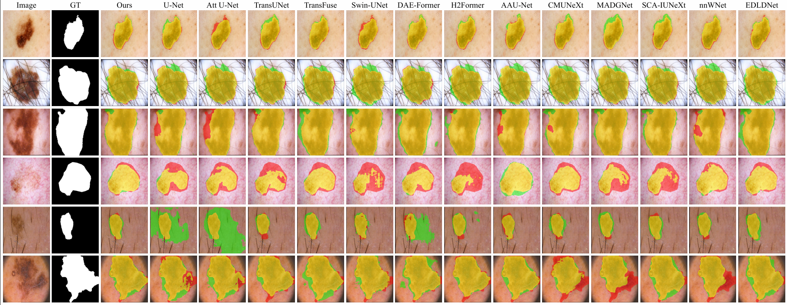

# DySA-Net

Official repository for the paper:

**Medical Image Segmentation via Dynamic Feature Synergy, Deformable Semantic Alignment and Context Perception Modulation**

## Status

The manuscript is currently under review.

To ensure reproducibility while respecting the publication process, the complete implementation, pretrained model weights, configuration files, and detailed documentation will be released **immediately upon acceptance** of the paper.

Thank you for your interest in our work.

## Overall Architecture

## SegVis

##Dataset
- [ISIC2016]([https://www.kaggle.com/your-dataset-link](https://challenge.isic-archive.com/data/#2016))
